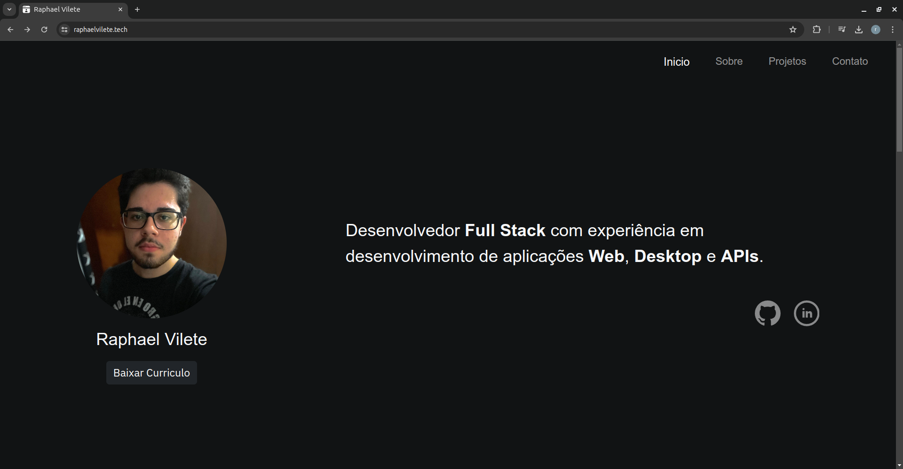

# Portfolio

> My portfolio – version 2.0

[![Live Website][url-image]][url]

    

## About the Project

An interactive portfolio designed to showcase my skills and experience as a Full Stack Developer. Built with HTML, CSS, JavaScript, and Bootstrap.

## License

This project is licensed under the MIT License – see the [LICENSE](LICENSE) file for details.

## Contact

For more information about the project or to get in touch, visit the [contact page](https://raphaelvilete.tech/#contact).

<!-- Markdown link & img dfn's -->

[url]: https://raphaelvilete.tech/
[url-image]: https://img.shields.io/badge/Live_Website-gray
